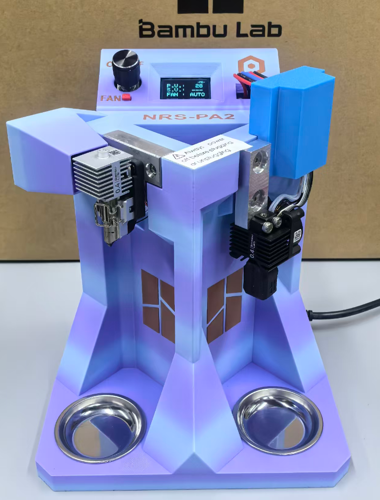

# Bambu Nozzle Repair Station (BambuNRS)

A DIY nozzle troubleshooting and repair station for Bambu Lab 3D printers (A/P/X series), built with ESP32 and ADS1115 ADC.


## Overview

The Bambu Nozzle Repair Station (BambuNRS) is a dedicated workstation for testing, cleaning and maintaining Bambu Lab printer nozzles — without tying up your 3D printer.

**Why a dedicated station?**
- Keep your 3D printer running — perform nozzle maintenance on a separate platform
- More control — stable base lets you apply proper force for hot/cold pull procedures
- Full fan control — freely toggle hotend cooling fan during maintenance for maximum assistance

**What you can do with BambuNRS:**

- **Hot/Cold pull maintenance** for nozzle cleaning and replacement
- **Heat hex wrench unclogging** for heat creep clogs
- **Cold pull** for thorough hotend cleaning after any unclogging procedure
- **Test nozzle heating** with PID temperature control
- **Switch between A/H2S/H2D/P2-series and P1/X1E-series** nozzles
- **Monitor temperature** via OLED display (P.V. and S.V.)
- **Fine-tune parameters** via Bluetooth serial connection
- **Detect thermal resistor open circuit** (shows "NC")
- **Control cooling fan** with automatic/manual modes

## Hardware

> [!NOTE]
> Assembly instructions with detailed photos are available in the [Assembly Guide](docs/assembly/assembly.md).

### Components

| Component | Model | Purpose |
|-----------|-------|---------|
| MCU | ESP32 Dev Module | Main controller |
| ADC | ADS1115 (16-bit) | High-precision temperature reading |
| Display | SSD1306 OLED 128x64 | Real-time status display |
| Encoder | Rotary Encoder with Button | Temperature setting |
| Power | 24V input (A-series) / 5V (P/X-series fans) | System power |

### Pin Wiring

```
ESP32          Component
──────         ─────────
GPIO18         Encoder Pin A
GPIO19         Encoder Pin B
GPIO5          Encoder Button
GPIO23         Fan Toggle Button
GPIO25         PWM Output L (A-series nozzle)
GPIO26         PWM Output R (P/X-series nozzle)
GPIO32         Fan L Control
GPIO33         Fan R Control
GPIO21         I2C SDA (ADS1115 & OLED)
GPIO22         I2C SCL
```

### ADS1115 ADC Channels

| Channel | Purpose |
|---------|---------|
| AIN0 | A-series nozzle temperature (NTC) |
| AIN1 | P/X-series nozzle temperature (NTC) |

## Features

### Temperature Control
- PID control with configurable P/I/D parameters
- Temperature range: 50°C - 300°C (default)
- High-precision ADC (16-bit) for accurate temperature reading
- Lookup table method for NTC to temperature conversion

### User Interface
- **Rotary Encoder**: Adjust target temperature
- **Short Press** (< 1.5s): Toggle heating on/off
- **Long Press** (> 1.5s): Switch between nozzle series
- **Fan Button**: Toggle cooling fan on/off
- **OLED Display**: Shows P.V. (actual), S.V. (target), fan status

### Bluetooth Configuration

Connect via Bluetooth (device name: `BambuNRS`) to adjust parameters:

| Command | Description | Range |
|---------|-------------|-------|
| `aXXX` | Set initial temperature | 0-255°C |
| `bXXX` | Set minimum temperature | 0-255°C |
| `cXXX` | Set maximum temperature | 100-355°C |
| `eXXX` | Set encoder increment | 0-255 |
| `pXXX` | Set PID P value | 0-255 |
| `iXXX` | Set PID I value | 0-255 |
| `dXXX` | Set PID D value | 0-255 |
| `fXXX` | Set temp method (0=calc, 1=table) | 0-1 |
| `r0` | Reset all EEPROM values | - |

### Nozzle Compatibility

| Series | Voltage | Fan Voltage | Default PID |
|--------|---------|-------------|-------------|
| A/H2S/H2D/P2 Series | 24V | 24V | P:60, I:10, D:5 |
| P1/X1E Series | 24V | 5V | P:60, I:10, D:5 |

**Note:** A/H2S/H2D/P2 series use 24V cooling fans, while P1/X1E series use 5V fans.

## Hardware Design

### Schematic

Two PCB designs are available:

| File | Description |
|------|-------------|
| [Main Controller V2.3](hardware/Schematic_Bambu-NRS_V2.3.pdf) | Main control board with ESP32, ADS1115, OLED |
| [Interface Board V1.1](hardware/Schematic_Bambu-NRS_Interface_V1.1.pdf) | Connector board for linking control board to hotend components |

### Fabrication Files

PCB manufacturing files (Gerber, BOM, Pick & Place):

**Main Controller V2.3:**
- [Gerber](hardware/Gerber_Bambu-NRS_V2.3_PCB_Bambu-NRS_V2.3.zip)
- [BOM](hardware/BOM_Bambu-NRS_V2.3.csv)
- [Pick & Place](hardware/PickAndPlace_PCB_Bambu-NRS_V2.3.csv)

**Interface Board V1.1:**
- [Gerber](hardware/Gerber_Bambu-NRS_Interface_V1.1_PCB_Bambu-NRS_Interface_V1.1.zip)
- [BOM](hardware/BOM_Bambu-NRS_Interface_V1.1.csv)
- [Pick & Place](hardware/PickAndPlace_PCB_Bambu-NRS_Interface_V1.1.csv)

### Key Circuit Features

| Feature | Implementation |
|---------|---------------|
| Power Input | 24V DC input with 1N5822 reverse-polarity protection |
| Voltage Regulation | LM2596 step-down converter to 5V |
| ESP32 Module | DevKit V1 with 40MHz crystal |
| ADC | ADS1115 (16-bit, I2C) with 4.7kΩ pull-up resistors |
| Temperature Sensing | NTC thermistor voltage divider circuit |
| OLED Display | SSD1306 128x64 I2C (0x3C) |
| Encoder | Rotary encoder with RC debounce filter (10kΩ + 100nF) |
| Heater Output | PWM via ESP32 LEDC (8-bit, 500Hz) |
| Fan Control | NPN transistor driving relay |
| Protection | Snubber diodes on inductive loads |

### Pin Assignment Summary

| ESP32 GPIO | Function |
|------------|----------|
| GPIO5 | Encoder button (with pull-up) |
| GPIO18 | Encoder pin A (interrupt) |
| GPIO19 | Encoder pin B (interrupt) |
| GPIO21 | I2C SDA (ADS1115 + OLED) |
| GPIO22 | I2C SCL (ADS1115 + OLED) |
| GPIO23 | Fan toggle button (with pull-up) |
| GPIO25 | PWM output L (A-series heater) |
| GPIO26 | PWM output R (P/X-series heater) |
| GPIO32 | Fan L control (NPN transistor) |
| GPIO33 | Fan R control (NPN transistor) |

### Hardware Configurations

The same PCB (V2.3) can be assembled into three different mechanical configurations:

| Configuration | Supported Nozzles | Notes |
|---------------|-------------------|-------|
| **AP Universal** | A/H2S/H2D/P2 Series + P1/X1E Series | Both nozzle types supported |
| **A-Type** | A/H2S/H2D/P2 Series only | For A-series only users |
| **P-Type** | P1/X1E Series only | For P/X-series only users |

> [!NOTE]
> All three configurations use the same PCB and firmware. The mechanical difference is only in the enclosure/nozzle adapter.

### Structure Files

CNC machining drawings for mechanical parts:

| File | Description | Material |
|------|-------------|----------|
| [A-Nozzle Base v1.3A](hardware/structure/A-Nozzle%20Base-v1_3A.pdf) | A-series nozzle assembly base | 6063 Aluminum |
| [P-Nozzle Base v1.1](hardware/structure/P-Nozzle%20Base-v1_1.pdf) | P-series nozzle assembly base | 6063 Aluminum |

Both parts: CNC machined, anodized finish.

### 3D Model

- [BambuNRS on MakerWorld](https://makerworld.com/en/models/2863055-bambunrs) — Printable enclosure and mechanical parts (International)
- [BambuNRS on MakerWorld (China)](https://makerworld.com.cn/zh/models/2576476-tuo-zhu-pen-zui-wei-xiu-tai) — 3D打印外壳和机械部件（中国）

### Gallery



More photos available in the [hardware/photos/](hardware/photos/) directory.

| Photo | Description |
|-------|-------------|
| [1-1.png](hardware/photos/1-1.png) | Overall view - angle 1 |
| [1-2.png](hardware/photos/1-2.png) | Overall view - angle 2 |
| [1-3.png](hardware/photos/1-3.png) | Overall view - angle 3 |
| [1-4.png](hardware/photos/1-4.png) | Overall view - angle 4 |
| [2-1.png](hardware/photos/2-1.png) | Back view - 1 |
| [2-2.png](hardware/photos/2-2.png) | Back view - 2 |
| [3-1.png](hardware/photos/3-1.png) | Detail - 1 |
| [3-2.png](hardware/photos/3-2.png) | Detail - 2 |
| [3-3.png](hardware/photos/3-3.png) | Detail - 3 |
| [3-4.png](hardware/photos/3-4.png) | Detail - 4 |
| [5-1.png](hardware/photos/5-1.png) | Full family (AP Universal / A-Type / P-Type) |

## Installation

### Requirements

- Arduino IDE with ESP32 board support
- Libraries:
  - `PID_v1` by Brett Beauregard
  - `Wire` (built-in)
  - `Adafruit_SSD1306`
  - `Adafruit_ADS1X15`
  - `EEPROM` (built-in)
  - `BluetoothSerial`

### Steps

1. Install ESP32 board support in Arduino IDE
2. Install required libraries via Library Manager
3. Open `BambuNRS-V2_3-ENG.ino`
4. Select appropriate board (ESP32 Dev Module)
5. Upload to device

## Safety Warning

> **IMPORTANT:** Always disconnect power before plugging or unplugging the P1/X1E Series nozzle connector. Failure to do so may damage the control board.

## Operation

### Basic Operation

1. Power on the station
2. Rotate encoder to set target temperature
3. Short press encoder button to start heating
4. OLED shows real-time temperature (P.V.) and target (S.V.)
5. Short press again to stop heating

### Nozzle Switching

Long press encoder button (>1.5s) to switch between:
- `-AH-` = A/H series nozzle (A1/A1 mini/H2S/H2D/P2)
- `-PE-` = P/X-series nozzle

The active nozzle is saved to EEPROM.

### Fan Control

Press back button to toggle cooling fan:
- `AUTO` = Fan on when temperature > 50°C
- `OFF` = Fan always off

## EEPROM Storage

Parameters are stored in ESP32's flash memory:

| Address | Parameter | Default |
|---------|-----------|---------|
| 0 | Flag (1=initialized) | 1 |
| 1 | Initial Temp | 210 |
| 2 | Min Temp | 50 |
| 3 | Max Temp | 280 |
| 4 | Encoder Increment | 5 |
| 5 | Temp Method | 1 |
| 6 | PID P | 60 |
| 7 | PID I | 10 |
| 8 | PID D | 5 |
| 9 | Active Nozzle | 1 |

## Temperature Table

The `thermistortable_80.h` file contains a lookup table for NTC thermistors commonly used in Bambu Lab hotends. The table covers 0°C to 360°C with 65 data points.

## Troubleshooting

### Display shows "NC"
- Thermal resistor (NTC) is open circuit
- Check NTC wiring and connections

### Temperature unstable
- Adjust PID parameters via Bluetooth
- Check NTC placement and contact

### Fan not working
- Verify fan voltage matches your printer series
- A-series: 24V fan, P/X-series: 5V fan

## Version History

### v2.2 (2026-04-26)
- Fixed 2 bugs

### v2.1 (2025-07-31)
- Added open circuit detection for thermistor
- Shows "NC" and prevents heater activation when open circuit detected

### v2.0 (2025-06-18)
- Rotation display support (180°)
- Encoder button long-press to switch nozzles
- EEPROM save for active nozzle state
- ADS1115 voltage output tested
- Extended temperature table accuracy

### v1.1 (2025-04-09)
- Added cooling fan on/off toggle (2s+ press)
- Added EEPROM reset command (`r0`)

### v1.0 (2025-04)
- Initial release

## License

**GPLv3** — See [LICENSE](LICENSE) file for details.

Copyright (c) 2026 Feng Xue

This program is free software: you can redistribute it and/or modify it under the terms of the GNU General Public License as published by the Free Software Foundation, either version 3 of the License, or (at your option) any later version.

This program is distributed in the hope that it will be useful, but WITHOUT ANY WARRANTY; without even the implied warranty of MERCHANTABILITY or FITNESS FOR A PARTICULAR PURPOSE. See the GNU General Public License for more details.

You should have received a copy of the GNU General Public License along with this program. If not, see <https://www.gnu.org/licenses/>.

## Acknowledgments

Thanks to the open-source community for libraries and documentation that made this project possible.

---

**Author**: Feng Xue  
**Email**: xuefeng@printxdreams.com
