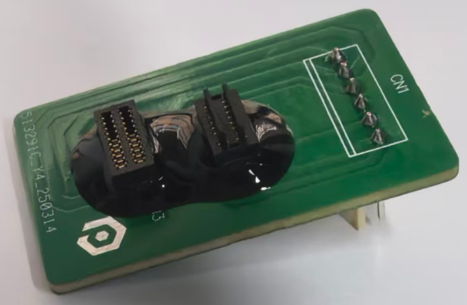
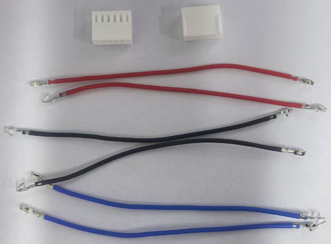
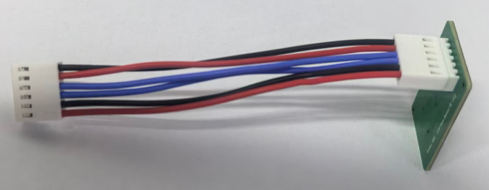
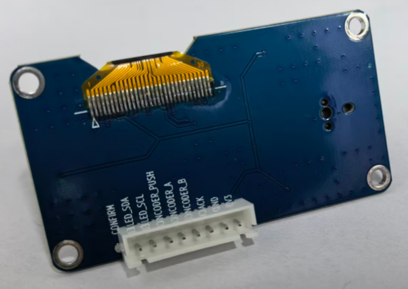
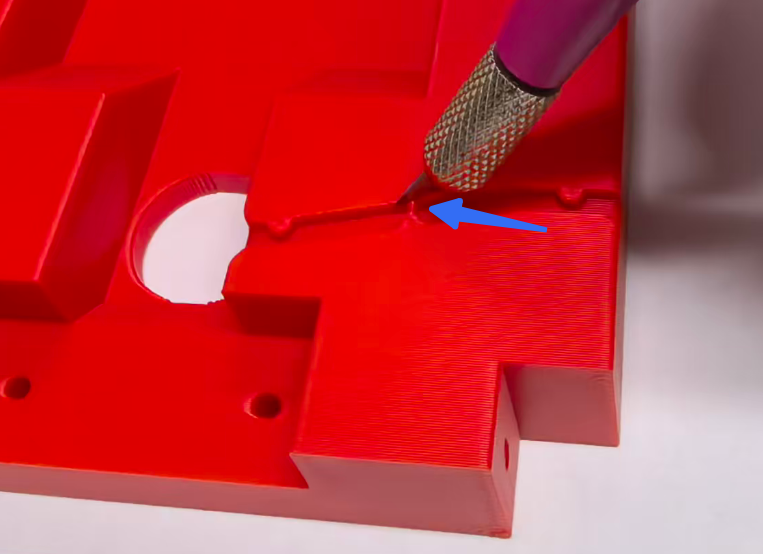
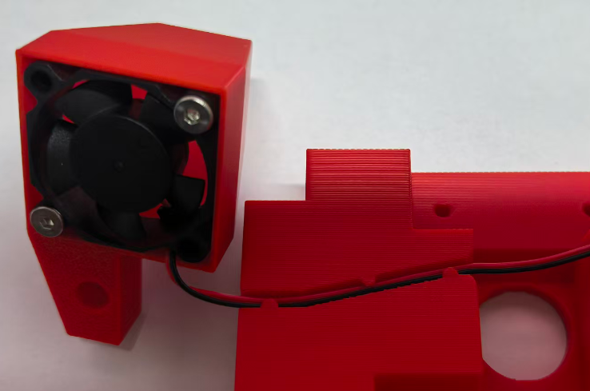

# Assembly Guide

> [!NOTE]
> Work in progress - tips and notes will be added incrementally.

## Assembly Tips

### NRS Interface Board

**Tip 1:** Apply glue to secure connectors on the Interface Board. Use electronic assembly adhesive to prevent connector sockets from falling off or getting damaged due to frequent plugging and unplugging.

**Tip 2:** Use KF2510 terminals and silicone wire to ensure current capacity above 3A.

**Tip 3:** After connecting the Interface Board.

<!-- More tips for NRS Interface Board -->

### OLED Screen Wiring

**Tip 1:** Use XH2.54-8P connector. Leave CONFIRM pin empty.

<!-- More tips for OLED screen wiring -->

### Fan Wire Routing

**Tip 1:** Cut off the fan wire clip support with a carving knife.

**Tip 2:** Fan wire routing example.

<!-- More tips for fan wire routing -->

---

*Last updated: 2026-06-03*