# Parts Selection Notes

> [!NOTE]
> Work in progress - content will be added incrementally.

## Electronics

### ESP32 Development Board

**Model:** ESP-32-32E

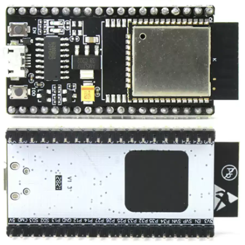

<!-- Notes on ESP32 -->

### OLED Display + Rotary Encoder Module

**Model:** 0.96" OLED Display + EC11 Rotary Encoder Combo Module with IIC Interface

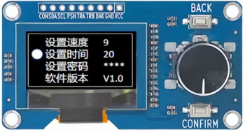

<!-- Notes on OLED and rotary encoder -->

### DC-DC Buck Power Module

**Model:** LM2596S Fixed Output 3.3V / LM2596S Fixed Output 5V (P-series only), 3A

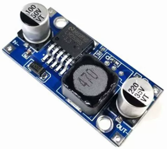

<!-- Notes on DC-DC module -->

### DC Cooling Fan (A-series only)

**Model:** 2510, 24VDC, XH2.54 Connector

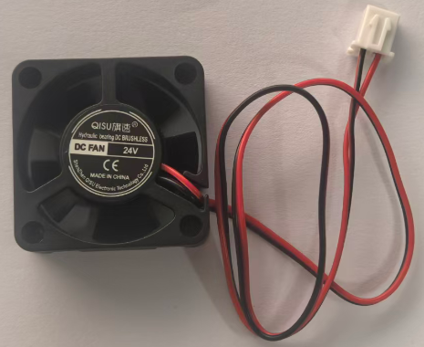

<!-- Notes on DC fan -->

### A1 Hotend Heater Component

**Model:** FAH012 (Third-party compatible)

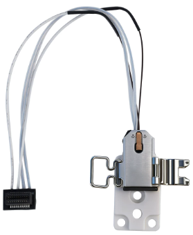

<!-- Notes on A1 hotend heater -->

### DC Power Supply

**Model:** 24V 5A, DC 5.5*2.5mm Connector

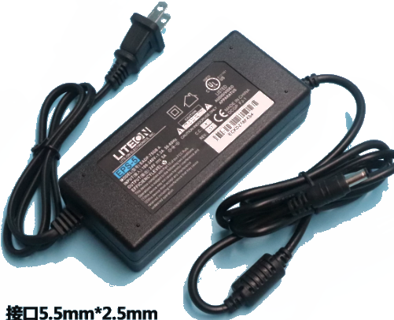

<!-- Notes on DC power supply -->

### DC Switch Cable

**Model:** DC 5.5*2.5mm, 5A

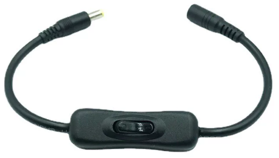

<!-- Notes on DC switch cable -->

### DC Power Socket

**Model:** DC-099, 5.5×2.5, with 10cm wire

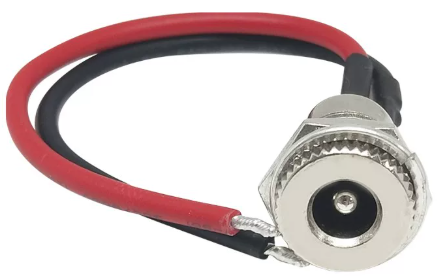

<!-- Notes on DC power socket -->

## Fasteners and Standard Parts

### Hexagon Socket Screws (内六角螺丝)

**Models:**
- M3×15 — For PCB mounting
- M3×12 — For A-series fan shroud, P-series hotend
- M3×5 — For OLED display

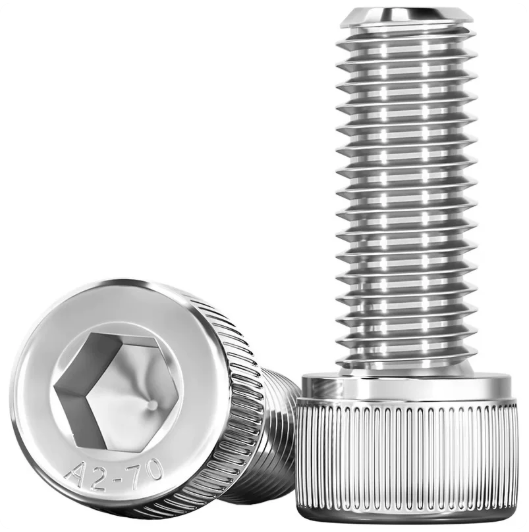

<!-- Notes on M3 hex screws -->

### Flat Head Screws

**Models:**
- M3×14, Head Diameter 6mm, Head Thickness 1mm — For A-series cooling fan
- M3×16, Head Diameter 8mm, Head Thickness 1mm — For P-series hotend base

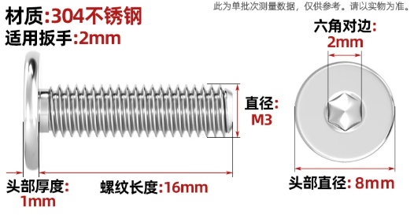

<!-- Notes on flat head screws -->

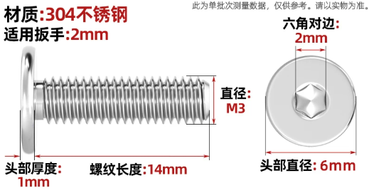

<!-- Notes on flat head screws -->

### PTFE High Temperature Washers

**Models:**
- 3×10×2 — For P-series hotend base
- 3×6×2 — For P-series hotend base

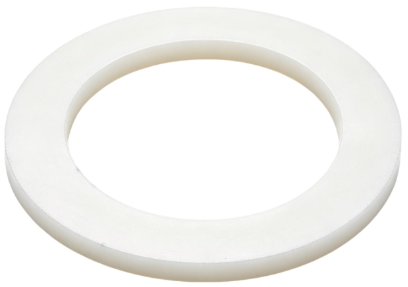

<!-- Notes on PTFE washers -->

---

*Last updated: 2026-06-03*